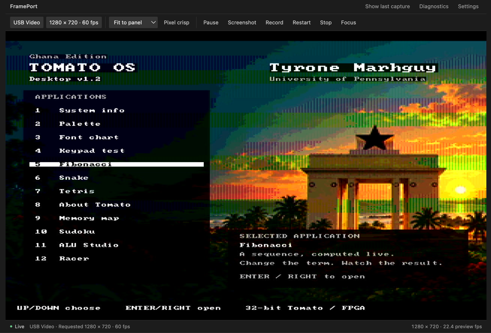
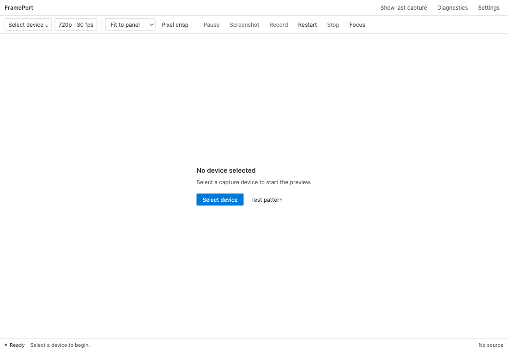
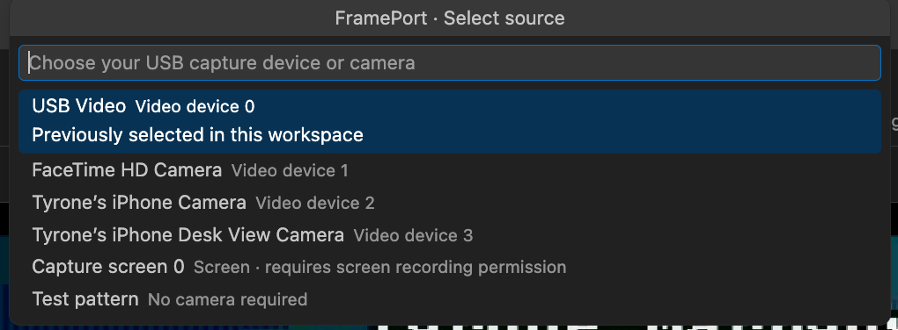
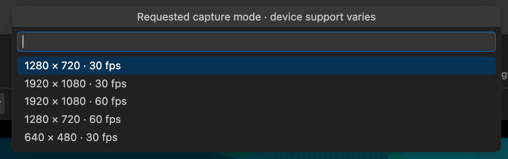

<h1 align="center">FramePort</h1>
<p align="center"><strong>HDMI and USB video capture inside VS Code.</strong></p>

<p align="center">
  <a href="https://github.com/tmarhguy/frameport/actions/workflows/ci.yml"></a>
  
  
  
  
  
</p>

FramePort opens an HDMI capture card or other USB video device in an editor tab. View FPGA HDMI output beside your code, inspect individual pixels, save a PNG screenshot, or record a silent MP4 clip without switching to a separate video application.

<table align="center">
  <tr>
    <td align="center" width="50%"></td>
    <td align="center" width="50%"></td>
  </tr>
  <tr>
    <td align="center"><em>Tomato OS through a USB capture card; requested settings and observed FPS shown separately.</em></td>
    <td align="center"><em>High-contrast theme supported.</em></td>
  </tr>
</table>

<table align="center">
  <tr>
    <td align="center" width="50%"><br /><em>Pick a source; a phone camera is not screen mirroring.</em></td>
    <td align="center" width="50%"><br /><em>Requested modes, not probed capabilities.</em></td>
  </tr>
</table>

## Why I built it

I needed to see my [Tomato](https://tomato.tmarhguy.com) FPGA's HDMI output while programming it. A USB capture card replaced the extra monitor, but viewing still needed another app — so the feed moved into VS Code. The [build journal](https://github.com/tmarhguy/frameport/tree/main/docs/log) tells the story.

## Features

- **Source and mode:** request a resolution/frame rate per device; screens use native size with a separate FPS choice.
- **Fit / native / integer, crisp / smooth:** fit the pane, inspect source pixels, or scale up; sharp edges or smoothed.
- **Pause / resume:** freeze the preview; capture and recording continue.
- **Screenshot:** save the displayed frame as PNG; oversized captures are refused with a message.
- **Record:** save the source as silent H.264 MP4 (source video only) under a new filename; never overwrites.
- **Focus:** hide toolbars (recording stays visible); Escape restores.
- **Stop / restart / last capture:** release or restart capture; closing finalizes recording; reveal the last PNG/MP4.

| Control | What it does |
| --- | --- |
| Source and mode | Request a resolution/frame rate per device; screens use native size with a separate FPS choice. |
| Fit / native / integer, crisp / smooth | Fit the pane, inspect source pixels, or scale up; sharp edges or smoothed. |
| Pause / resume | Freeze the preview; capture and recording continue. |
| Screenshot | Save the displayed frame as PNG; oversized captures are refused with a message. |
| Record | Save the source as silent H.264 MP4 (source video only) under a new filename; never overwrites. |
| Focus | Hide toolbars (recording stays visible); Escape restores. |
| Stop / restart / last capture | Release or restart capture; closing finalizes recording; reveal the last PNG/MP4. |

## Requirements

- Desktop VS Code **1.95+** in a trusted local workspace (remote, browser-only, and untrusted workspaces are unsupported).
- **macOS** for device capture. Windows/Linux: test pattern only.
- **FFmpeg** with `libx264` on PATH. FramePort also checks `/opt/homebrew/bin/ffmpeg` and `/usr/local/bin/ffmpeg` on macOS, or set `frameport.ffmpegPath`.
- Camera and screen-recording permission when macOS asks.

Preview candidate, not a Marketplace release.

## Get started

1. In VS Code run **Extensions: Install from VSIX…** and select `frameport-0.2.0.vsix`.
2. Run **FramePort: Open Capture Device** → **Select device**, or **Test pattern** to verify without hardware.
3. Pick a capture mode your device supports. Allow camera access if macOS asks.
4. Use Pause, Screenshot, Record, Focus, and Diagnostics from the panel toolbar or Command Palette.

FFmpeg is auto-found in Homebrew paths or PATH; override with `frameport.ffmpegPath` if VS Code's PATH differs from your terminal's.

## Extension Settings

| Setting | Default | Use |
| --- | --- | --- |
| `frameport.ffmpegPath` | `ffmpeg` | Executable override. |
| `frameport.previewFps` | `30` | Preview cap: `15`, `30`, or `60`. |
| `frameport.recordingEncoder` | `software` | `libx264`, or macOS VideoToolbox `hardware` (larger files). |

## Commands

| Command | What it does |
| --- | --- |
| `FramePort: Open Capture Device` | Open the capture panel. |
| `FramePort: Select Device` | Pick a source and requested mode. |
| `FramePort: Take Screenshot` | Save the displayed frame as PNG. |
| `FramePort: Start / Stop Recording` | Record silent H.264 MP4; never overwrites. |
| `FramePort: Restart Stream` | Restart capture on the current source. |
| `FramePort: Stop Stream` | Release the device. |
| `FramePort: Show Diagnostics` | Inspect FFmpeg output on failure. |
| `FramePort: Show Last Capture` | Reveal the last PNG/MP4 in your file manager. |

## Known issues and troubleshooting

One FFmpeg process while viewing, one more while recording; frames are skipped rather than queued under load, so preview FPS is observed output, not latency. No audio, editing, broadcasting, or phone mirroring; browser-only VS Code is unsupported. The transport is JPEG, so PNG screenshots are not lossless.

- **FFmpeg won't launch:** set its full path; VS Code's PATH differs from the terminal's.
- **No frames:** check permissions, cables, other apps holding the device, and a lower mode; see **Diagnostics**.
- **Recording fails:** confirm the encoder exists in your FFmpeg build and pick a new writable filename.
- **Black frames:** some cards emit black when HDMI drops; the video alone can't always tell.

## Build from source

```sh
npm ci && npm run check && npm test && npm run package
```

Install the VSIX via **Extensions: Install from VSIX…**, or press **F5** to hack. Guides: [development](https://github.com/tmarhguy/frameport/blob/main/docs/DEVELOPMENT.md), [publishing](https://github.com/tmarhguy/frameport/blob/main/docs/PUBLISHING.md), [issues](https://github.com/tmarhguy/frameport/issues).

## Release Notes

See [CHANGELOG.md](https://github.com/tmarhguy/frameport/blob/main/CHANGELOG.md): `0.2.0` adds MP4 recording, native-size screen sources, an optional VideoToolbox encoder, and hardened save handling.

## Author and license

Built by [Tyrone Marhguy](https://tmarhguy.com) from the [Tomato](https://github.com/tmarhguy/tomato) workflow. No distribution terms selected yet (`UNLICENSED`); no open-source license granted by this preview.
